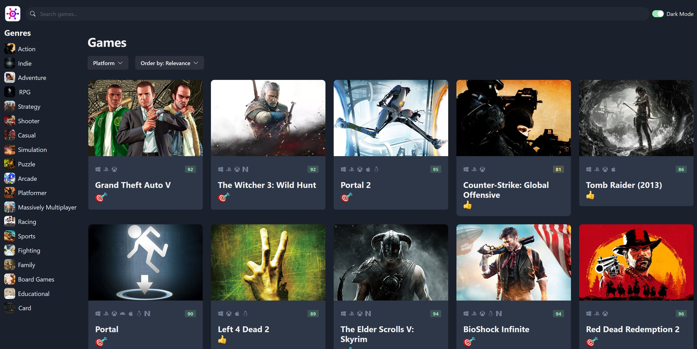
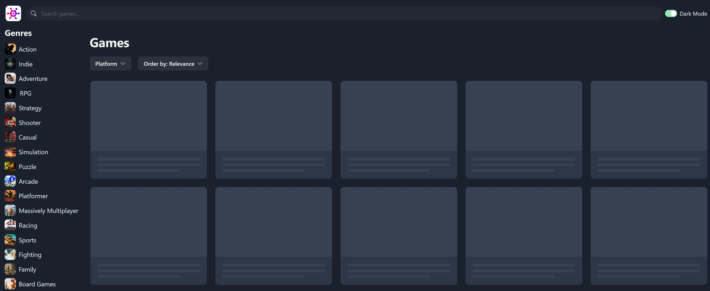
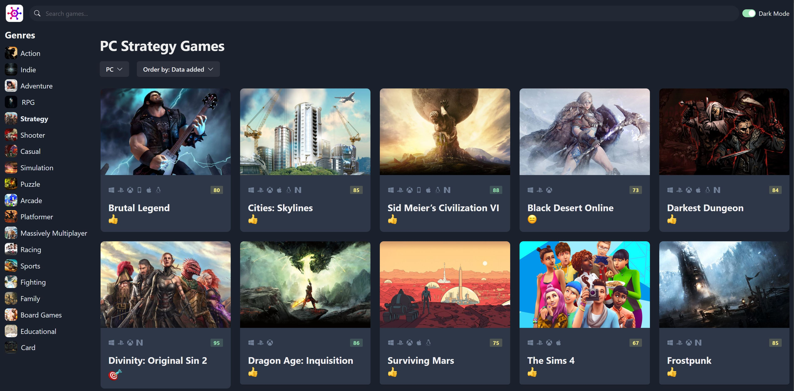
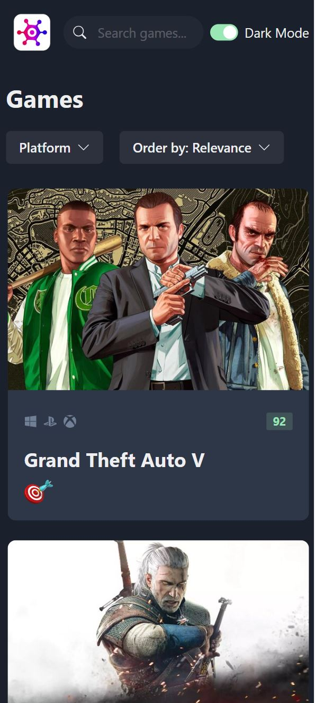

# Game Portal

## Name

Game Portal

## Description

Welcome to the Game Portal project! This React application allows you to browse and explore video games. It adheres to best practices for component creation in ReactJS and TypeScript. The project is designed with both dark and light modes to provide a comfortable user experience, and it is fully compatible with mobile and tablet devices. Additionally, the project utilizes Chakra UI for enhanced design and functionality.

Note: This project is powered by the rawg.io API, providing access to a vast collection of game-related data.

## Project information

- Language and version: **TypeScript**
- Platform and version: **Node 14.0+**
- Core Packages: **TypeScript** **React** **Chakra**

## Installation

- Go to the main folder (where `package.json` is)
- Run `npm install` to install all the dependencies
- Run `npm run dev` to run the vite server
- Open the Local link in the browser

## Screenshots

Main Page:

Loading/Skeleton Page:

Filters By Genre/Platform:

Mobile/Tablet Compatibility:

