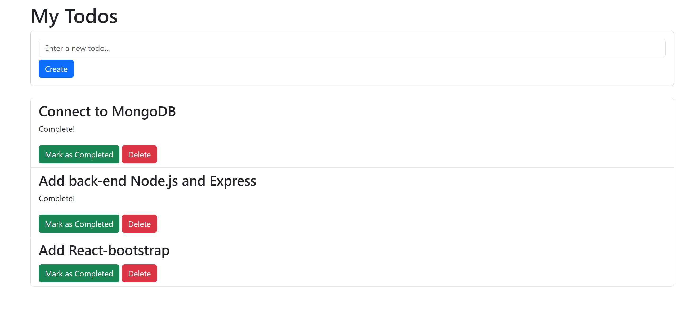

# To Do App

## Description

The MERN To-Do App is a humble task management application, rooted in the simplicity of the MERN stack: MongoDB, React, Node.js, and Express. This unpretentious application enables you to create, delete, and mark tasks as complete, making task management a straightforward endeavor. All your tasks are securely stored in MongoDB, ensuring your to-do list is organized and easily accessible.

## Project information

- Language and version: **JavaScript**
- Platform and version: **Node 14.0+**
- Core Packages: **MongoDB** **React** **Node.js** **Express** **React-Bootstrap**

## Installation

- Go to the 'todos-front-end' folder (where `package.json` is)
- Run `npm install` to install all the dependencies
- Run `npm run start` to run the server
- Open the Local link in the browser

- Go to the 'todos-back-end' folder (where `package.json` is)
- Run `npm install` to install all the dependencies
- Run `npm run dev` to run the server
- Open the Local link in the browser

## Screenshots

Main Page:

